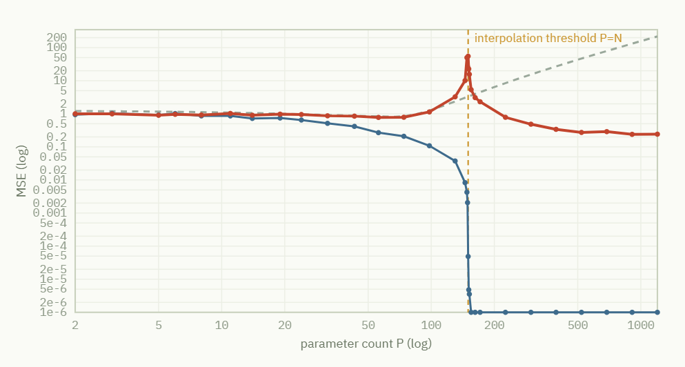

# Where the Textbook Stops — A Double Descent · Grokking Reproduction Lab

**[English](README.md) · [한국어](README.ko.md)**

> **An AI-fundamentals deep-dive · a hands-on reproduction lab notebook that runs entirely in your browser.**
>
> The textbook says "a complex model overfits." So why does a GPT-scale model — with far more parameters than data — work so well?
> This page reproduces two phenomena that break that textbook claim — **double descent** and **grokking** — with **real numerical simulation inside your browser**, no external data and no server. Every point on every chart is computed right now, on your device.

It's a **single HTML file** — nothing to install. Just open it.



---

## 🔬 Try it now

- **Live demo (English):** https://kraewon7422.github.io/double-descent-grokking-lab/index.en.html
- **Live demo (한국어):** https://kraewon7422.github.io/double-descent-grokking-lab/
- **Run locally:** download `index.en.html` and open it in any browser (Chrome, Edge, Safari…). No build, no server, no internet connection required.

---

## The question it tackles

The overfitting & generalization chapter of an intro-ML textbook teaches the **bias–variance trade-off**: a model that is too simple can't even capture the training rules (underfitting), while one that is too complex memorizes the noise and does worse on new data (overfitting). So test error traces a **U-shape** against complexity.

But if that picture were the whole story, a giant model with far more parameters than data should sit at the far-right, *worst* end of the U. **Reality is the opposite.** This lab reproduces the two phenomena that resolve the paradox — and the punchline is: the textbook isn't wrong, it just had a **domain of validity.**

---

## Three tabs

### 01 · Theory
Starts from the bias–variance U-curve and explains, with diagrams and equations, **why** double descent (the model-size axis) and grokking (the training-time axis) happen. It connects the two as cross-sections of a single story — *"excess capacity + regularization pressure discovering a simple solution"* — and summarizes the **five papers** this lab stands on.

### 02 · Double Descent (the model-size axis)
Grow the parameter count **P** past the data count **N** and measure test error.

- **Data:** `N` samples of `y = w*·x + ε`, noise `ε ~ N(0, σ²)`, from `x ∈ ℝ^D` (default D=15)
- **Model:** linear regression on random Fourier features `φⱼ(x) = √(2/P)·cos(vⱼ·x + bⱼ)`
- **The crux:** for `P < N` we solve the **least-squares** solution; for `P ≥ N` the **minimum-norm interpolant** `β̂ = Φᵀ(ΦΦᵀ)⁻¹y` — the mathematical heart of double descent.

Test error explodes once at `P = N` (the interpolation threshold), then descends again **below** the first U's valley. The curve grows left-to-right in real time, and the three regions (classical min / peak / modern min) plus a verdict are auto-summarized.

The **three deciding conditions for the peak** — ① label noise σ>0, ② high-dimensional input, ③ the minimum-norm interpolant — can each be toggled with a preset:

| Preset | What it shows |
|---|---|
| Default (σ=0.25) | full double descent — peak and re-descent |
| No noise (σ=0) | no noise to explode → the peak vanishes |
| Louder noise (σ=0.5) | the peak explodes |
| Ridge (λ=10⁻³) | explicit regularization erases double descent |
| Low dim (D=2) | the threshold can't form (condition ②) |
| Wide bandwidth (γ=1.0) | the peak explodes but the second descent fails |

### 03 · Grokking (the training-time axis)
Actually train a small neural net on **modular addition** `a + b (mod p)`.

- **Task:** of all `p²` pairs (a,b), train on a fraction, test on the rest
- **Model:** a 2-layer MLP — one-hot input `2p`-dim → hidden layer (default 96, activation `φ(h)=h²`, Gromov 2023) → output `p`-dim
- **Training:** full-batch **AdamW** + **weight decay**, MSE loss, accuracy logged every 20 steps

Training accuracy (blue) hits 100% almost instantly — it has **memorized** every answer. But test accuracy (red) crawls along the floor for a long time, then **suddenly jumps** thousands of steps later. The phase transition from memorization to understanding is printed right onto the graph; the memorization and grokking moments and the plateau length are auto-detected.

| Preset | What it shows |
|---|---|
| Default (λ=1.0, 50%) | memorize → long plateau → jump (grokking occurs) |
| weight decay 0 (λ=0) | no pressure to erode the memorization circuit → **eternal memorization** |
| Data 30% | too few training pairs → the generalizing circuit can't form |
| Multiplication (a×b) | the same drama repeats for a different operation |
| ReLU activation | vs h² — why the jump doesn't come within the same budget |

---

## Technical implementation

Everything is **dependency-free vanilla JavaScript** — no external libraries, no server, no data. All numbers are computed in your browser with a `mulberry32` seeded RNG.

- **Linear algebra:** a hand-written Gaussian elimination with partial pivoting (`solveSym`) solves the normal / kernel equations.
- **Double descent:** `P < N` uses least-squares on the Gram matrix `ΦᵀΦ`; `P ≥ N` uses the minimum-norm interpolant via the kernel matrix `ΦΦᵀ`. Each P is run several times and the median is taken.
- **Grokking:** a 2-layer MLP with hand-coded forward pass, back-propagation, and AdamW. A `requestAnimationFrame` loop animates training in real time.
- **Charts:** a custom `LinePlot` draws log/linear axes, ticks, guide lines, and series toggles directly onto a `<canvas>`.
- **UI:** built with Fable. Noto Serif KR / IBM Plex Sans·Mono fonts, responsive layout, `prefers-reduced-motion` support.

---

## The papers this experiment stands on

- **Belkin, Hsu, Ma & Mandal (2019)** — *PNAS 116(32).* Coined "double descent." Tab 02 is a miniature of this experiment.
- **Mei & Montanari (2022)** — *Comm. Pure Appl. Math. 75(4).* Proves the peak sits exactly at P/N=1 (the gold dashed line).
- **Nakkiran et al. (2019)** — *ICLR 2020.* Double descent along both model-size and training-time axes in real deep nets. The bridge between Tabs 02 and 03.
- **Power et al. (2022)** — *arXiv:2201.02177 (OpenAI).* The paper that discovered grokking.
- **Gromov (2023)** — *arXiv:2301.02679.* Reproduces modular-addition grokking with just a 2-layer MLP (squared activation). The basis for Tab 03's model.

---

## Repository layout

```
index.en.html                  # English version
index.html                     # Korean version (GitHub Pages entry point)
더블디센트_그로킹_실험실_v2.html   # original filename (identical to index.html)
README.md                      # this file (English)
README.ko.md                   # Korean README
screenshot.png                 # preview image
```

---

*Built for an AI-fundamentals deep-dive. Everything is computed inside your browser — no external data, no server.*
